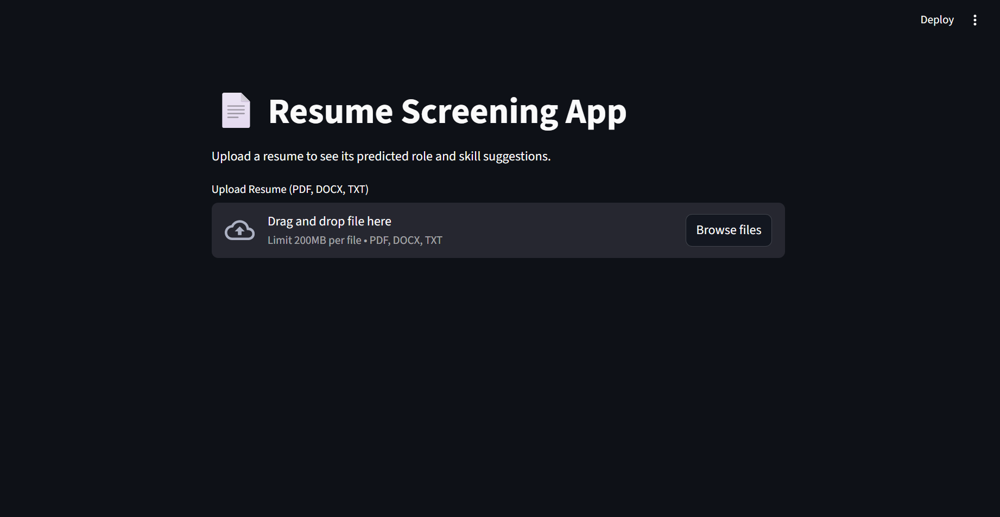
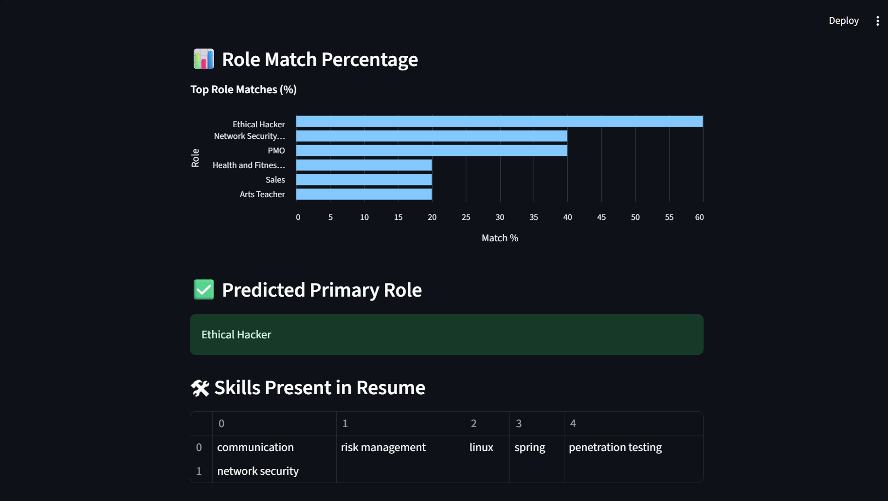
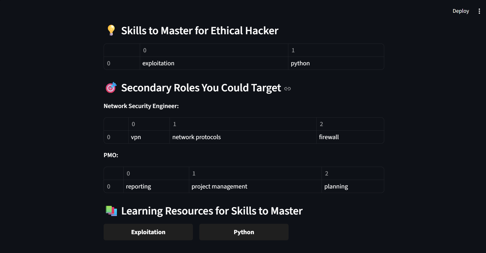
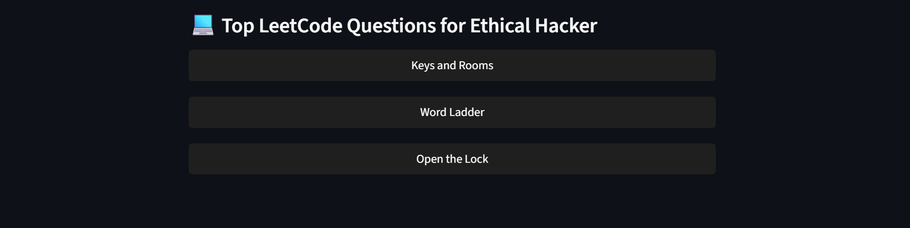
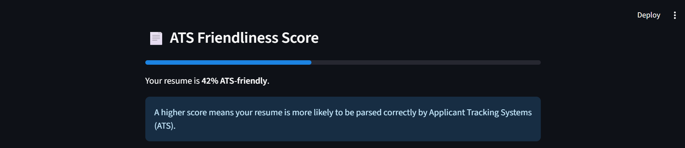

# 📄 Resume Screening App

[](https://www.python.org/)
[](https://streamlit.io/)
[](LICENSE)

A web-based application that predicts the best-fit role based on skills extracted from a resume, suggests skills to master, provides learning resources, lists top LeetCode questions for the role, and checks ATS compatibility.

## 🧱 Folder Structure

```
resume-screening/
  1. app.py # Main Streamlit app
  2. src/
     a. model.pkl # Pre-trained ML model
     b. vectorizer.pkl # Vectorizer for feature extraction
     c. role_skills.pkl # Role-skill dictionary
  3. requirements.txt # Python dependencies
  4. screenshots/ # Screenshots for README
  5. README.md # Project documentation
```


## 🚀 Features

1. **Resume Parsing & Skill Extraction**
   - Extracts text from PDF, DOCX, and TXT resumes.
   - Cleans and preprocesses the text.
   - Extracts predefined skills based on role-skills dictionary.

2. **Role Prediction**
   - Predicts primary and secondary roles based on skill matching.
   - Suggests missing skills to master for each role.

3. **Role Match Visualization**
   - Displays a bar chart of role match percentages.

4. **Learning Resources**
   - Provides curated learning links for skills to master.

5. **Top LeetCode Questions**
   - Suggests top interview/LeetCode questions for the predicted role.

6. **ATS Compatibility Checker**
   - Evaluates if the resume is ATS-friendly and shows a percentage score.

---

## 📸 Screenshots

### 1. Upload Resume Page


### 2. Role Prediction & Skills Found


### 3. Skills to Master & Learning Resources


### 4. Top LeetCode Questions


### 5. ATS Compatibility Score


> 

---

## 🛠 Technologies & Tools

- **Frontend / UI:** Streamlit
- **Backend / Data Processing:** Python, Pandas, re (regex)
- **Resume Parsing:** PyMuPDF (fitz), docx2txt
- **Machine Learning:** Scikit-learn (vectorizer, pre-trained model)
- **Visualization:** Altair
- **Version Control:** Git, GitHub

---

## ⚙ Algorithms / Logic

- **Skill Extraction:** String matching against role-skills dictionary.
- **Role Prediction:** Counting matched skills & ranking roles by match count.
- **ATS Compatibility:** Keyword density, formatting checks, and readability scoring.
- **Role Match Percentage:** `(matched skills / total role skills) * 100`

---

## 📊 Dataset

- Predefined **role-skills dictionary** based on Kaggle dataset by **Gaurav Dutta**.
- Used to extract relevant skills and match resumes with roles.

---

## 📂 How to Run

1. Clone the repository:

```bash
git clone https://github.com/nisthajain12/Resume-screening-app.git
cd Resume-screening-app
Install dependencies:

bash
Copy code
pip install -r requirements.txt
Run the app:

bash
Copy code
streamlit run app.py
🙏 Credits
Kaggle dataset by Gaurav Dutta for role-skills mapping.

Python open-source libraries: Streamlit, PyMuPDF, docx2txt, Pandas, Scikit-learn, Altair.

📧 Contact
Developer: Nistha Jain

GitHub: nisthajain12

Email: nisthajain2812@gmail.com
